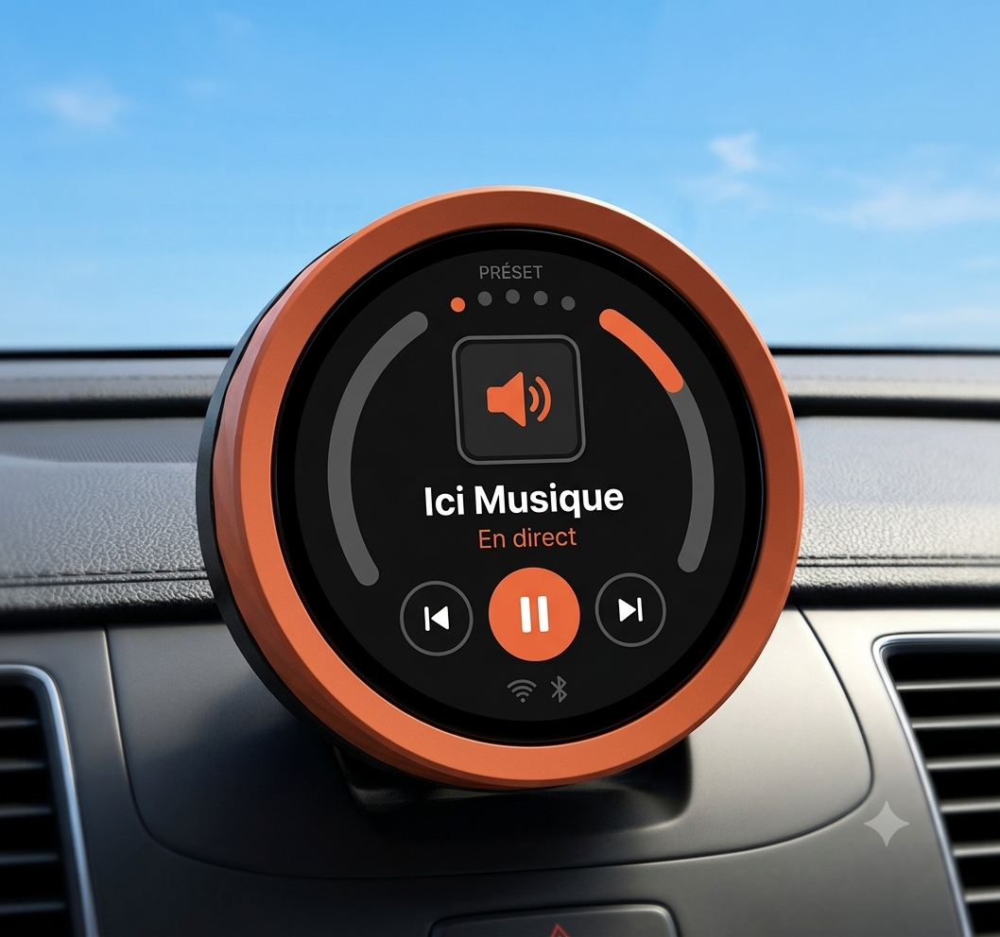

# Préset — the automatic car radio

**You start the car. It plays. Your phone stays out of sight.**



Préset is a small knob for your dashboard that turns your favourite internet
radio stations and podcasts into old-school car-radio presets. Pick five before
you install; after that there's nothing to do — get in, drive off, and the right
preset is already playing. No app, no account, no subscription. Your phone just
shares its connection and stays in your pocket; the steering-wheel
prev/next buttons flip between presets like the buttons of an old car stereo.

It's an open project — the firmware, hardware plans and this page all live here.
Under the hood it's a **dual-chip ESP32 design**: an ESP32-S3 does WiFi, decoding
and the UI, and streams audio over a tiny UART link to an ESP32-U4WDH that is the
Bluetooth (A2DP) source to the car. Analog line-out is supported too.

---

## For listeners

### Install (no toolchain, from your browser)

The whole thing flashes from a Chromium browser (Chrome/Edge on a computer) — no
software to install. The published installer (GitHub Pages, built by CI) walks
you through it:

1. **Name your device** and **pick five presets** — search live radio
   (radio-browser), search podcasts (Apple directory) or paste a URL, and give
   each preset an optional schedule.
2. **Plug in and flash.** The board has two USB-C ports (one per chip): flash the
   Bluetooth bridge from its port, then the main chip from its. After the main
   flash, your device name + presets are sent to it automatically over USB.
3. **Set Wi-Fi and speaker** from the setup hotspot the device raises on first
   boot (a captive portal opens on your phone — two fields).

After that: start the car, it plays. Every time. Updates arrive over Wi-Fi (OTA),
so you never unplug it again.

### What you need

- **A Préset** — build it yourself from the plans here, or use a compatible
  all-in-one board ([ESP MUSE](https://raspiaudio.com/muse/)).
- **A phone that shares its connection** (hotspot). Your usual plan is plenty;
  it barely uses data.
- **A Bluetooth speaker** — your car is one; any portable speaker works too.
  (Or skip Bluetooth and use the analog line-out into an AUX jack.)

---

## For developers

The repository is firmware + a shared protocol + a browser installer, all built
and tested in CI.

### Architecture

```
ESP32-S3 (WiFi + HLS + codecs -> PCM)  --[UART forward, COBS]-->  ESP32-U4WDH (PCM -> SBC -> A2DP)  -->  car
ESP32-S3  <----------------------------[UART return, COBS control]----------------------------  ESP32-U4WDH
```

The S3 does all the heavy lifting (WiFi, HLS, codecs, display, UI); the U4WDH is
a dumb, reliable A2DP source. They talk over one full-duplex UART carrying
COBS-framed PCM forward and a COBS-framed control plane back. The prototype that
de-risked this validates that the board carries a 44.1 kHz/16/stereo stream
(~176 KB/s) over the link and emits it as A2DP, stably, with bounded clock drift.
Full plan: [`docs/prototype-plan.md`](docs/prototype-plan.md).

### Layout

| Path | What |
|---|---|
| `components/pcm_link/` | **Shared protocol** (both firmwares + host tests): COBS codec, typed logical frame, streaming reassembler, control-message codec, wire constants & pinout. Pure C, no ESP-IDF deps. |
| `firmware/s3_sender/` | **ESP32-S3** (target `esp32s3`): ESP-ADF radio pipeline, WiFi, encoder, station list, LVGL UI + touch, haptic, analog DAC path, captive portal, serial provisioning — all behind Kconfig. |
| `firmware/u4wdh_bridge/` | **ESP32-U4WDH** (target `esp32`): UART RX → COBS → CRC/seq → jitter buffer → A2DP source + AVRCP target, plus the return-channel control transmitter. |
| `web/` | The browser installer: `index.html` (landing) + `install.html` (ESP Web Tools flasher + serial provisioning). |
| `test/host/` | Host unit tests (no hardware): COBS round-trip & overhead, frame/control build/parse, CRC + resync-after-corruption, jitter buffer wrap/overrun/underrun. |

The single shared `pcm_link` component is the key choice: the exact COBS/framing
code that runs on both chips is also compiled and unit-tested on the host, so the
protocol's correctness is verifiable in CI without hardware.

### The wire protocol (COBS)

A logical frame is serialized little-endian, then COBS-encoded, then terminated
by a single `0x00`:

```
[ type(1) | seq(1) | length(2 LE) | payload(length) | crc8(1) ]  -- serialize -->  raw bytes
raw bytes  -- COBS encode -->  body with NO 0x00  -->  append 0x00 delimiter
```

COBS guarantees `0x00` never appears inside the body, so it is an unambiguous,
always-resyncable boundary — what a 3 Mbps link without hardware flow control
needs. Overhead for a 512-byte payload: **~1.8%**. The leading **`type`** byte
multiplexes audio with a bidirectional **control plane** (`AUDIO`/`CONTROL`/
`OTA_DATA`/`ART_DATA`); a `CONTROL` frame carries `[opcode | args…]`
([`control_msg.h`](components/pcm_link/include/control_msg.h)) for BT
pairing/status, the AVRCP relay, now-playing metadata, flow control, the version
handshake and OTA. Audio sequence tracking is per-stream, so interleaved control
frames never look like an audio gap. See
[`pcm_link_proto.h`](components/pcm_link/include/pcm_link_proto.h) for constants
and the schematic-confirmed pinout.

### Build & test

```sh
# Host unit tests (no hardware, no ESP-IDF)
make -C test/host test

# Firmware (ESP-IDF v5.x) — TONE build (link validation, no WiFi)
cd firmware/s3_sender   && idf.py set-target esp32s3 && idf.py build
cd firmware/u4wdh_bridge && idf.py set-target esp32   && idf.py build
```

The full product S3 image (real internet radio + UI + portal + haptic) needs
ESP-ADF (`ADF_PATH` exported) and is configured under **Preset S3 sender** in
`menuconfig` (audio source, Wi-Fi, UI/haptic/portal/provisioning toggles,
encoder GPIOs). ESP-ADF registers a board-specific `audio_board`; pick any
ESP32-S3 board under **Audio HAL → Audio board** (CI uses `ESP32-S3-Korvo-2`) —
it's never driven, but its pin table has to compile. Flash each chip from its
own USB-C port (`idf.py -p <port> flash monitor`).

### CI pipeline

Two stages: **`ci.yml`** runs the fast host unit tests (no hardware), and
**`install-page.yml`** builds the real firmware for both chips (the U4WDH bridge
+ the full ESP-ADF + UI + portal + haptic S3 image), `merge-bin`s each into a
flashable image, wraps them in ESP Web Tools manifests, and publishes `web/` —
uploaded as an artifact every run and deployed to GitHub Pages on the default
branch / tags. The install build is the firmware compile-check.

### Product features (on the validated prototype)

All behind Kconfig and compiled in CI:

- **Control plane** — typed COBS frame + control-message codec multiplex audio
  with control over the one link (host-tested).
- **Display + touch + haptic** — `display_st77916.c` (QSPI + PWM backlight),
  `touch_cst816.c` (CST816S) and `haptic.c` (DRV2605 LRA) share the S3's
  mutex-guarded I2C bus (`i2c_bus.c`); pins in `board_pins.h` (from the schematic).
- **UI** — LVGL preset screen, settings (brightness→NVS, output mode), transient
  boot/Wi-Fi/pairing/error overlays, and album art (`album_art.c`: favicon over
  HTTPS → LVGL JPEG decode).
- **Audio output** — `audio_output.c` routes Bluetooth (UART→U4WDH→A2DP) or
  analog (`dac_control.c`: S3 I2S → PCM5100); the DAC's XSMT mute lives on the
  U4WDH, un-muted over the control plane.
- **Playlist + provisioning** — NVS-backed 5-preset playlist (`station.c`),
  configured via the captive portal (`portal.c`) or the browser installer's USB
  serial handoff (`provisioning_serial.c`: parses `PROVISION:{…}`, persists,
  reboots). Now-playing title relayed to the car.
- **Auto-play schedules** — each preset can carry a schedule (days + time
  window) from the installer; the firmware syncs the clock (`time_sync.c`, SNTP +
  timezone) and, on Bluetooth connect or first time-sync, jumps to the preset
  whose window is active now (`schedule.c`, a pure host-tested picker). So the
  device starts on the right station for the moment — no touch needed.
- **Podcasts** — a podcast preset's URL is an RSS feed; `podcast.c` resolves it
  to the latest episode's audio (`podcast_parse.c`, a pure host-tested
  `<enclosure>` extractor) and plays that. The play position is remembered per
  feed: when the car's Bluetooth has been gone for more than 10 s, the position
  at the drop is saved and playback **resumes there** on reconnect (an HTTP
  Range request via `adf_pipeline`), so you pick up where you left off. The saved
  position is tied to the episode — if a **newer episode** dropped while you were
  away, it starts the new one from the beginning instead.
- **BT pairing + AVRCP** — the return UART carries COBS control frames
  (`link_tx.c`): the bridge reports status/scan results, accepts pair commands,
  and relays the car's steering-wheel buttons to the S3.

### Roadmap

Done: link validation, the full S3 feature set above, the dual-chip control
plane. Next: OTA (S3 A/B from GitHub Releases + U4WDH-over-UART + version
handshake), then image signing. AVRCP cover-art to the car and telemetry are
out of v1 scope. See [`docs/prototype-plan.md`](docs/prototype-plan.md) and the
product plan.
